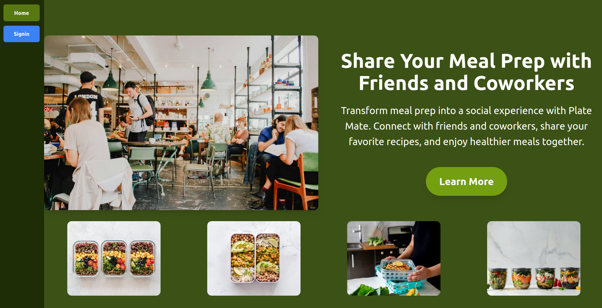
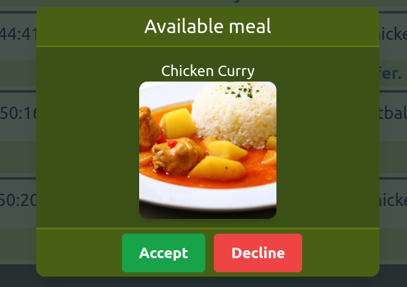
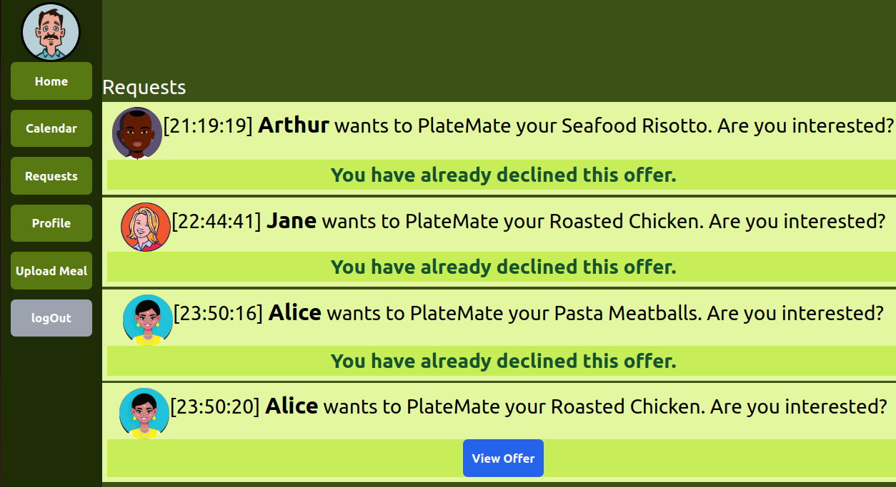

# PlateMate

- Web Application for users to share their prepped meals with others.
## Stack
- Firebase for authentication, storage and database.
- React for single page web application.
- TailwindCSS for styling.

